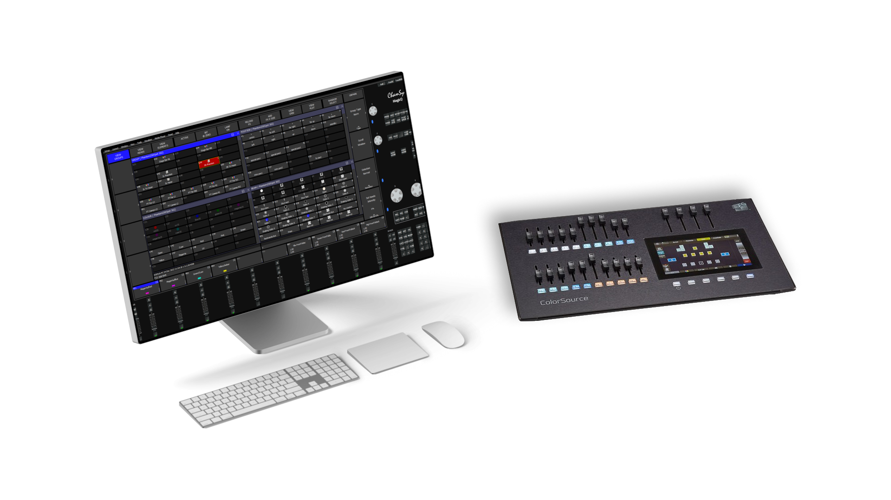

# ColorSource MagicQ Bridge
Open source software to link your [ColorSource](https://www.etcconnect.com/Products/Consoles/ColorSource/Features.aspx) faders to [MagicQ PC](https://chamsyslighting.com/products/magicq)

### Installation
Clone [this project](https://github.com/verityyt/cs-magicq-bridge) and run the CSMagicQBridge.kt file

### Configuration (Software)
- **Logs** (Configure which type of logs you want to be printed into your console)
- **Links** (Create "links", to set which ArtNet channels perform which action)

### Configuration (MagicQ)
Create a **Macro** for every action you want to be performed by this software

### Configuration (ColorSource)
- Set Network Output Protocol (Settings > Network) to ArtNet
- Configure on which ArtNet universe you want your ColorSource to output
- Connect your CS to the same network as your PC

### Requirements
- **Java** has to be installed
- **MagicQ PC** has to be installed
- Your **ColorSource** has to be a **AV** edition (connected to the same network as your pc)

### Special thanks to
[cansik](https://github.com/cansik) - Developer of the [artnet4j](https://github.com/cansik/artnet4j) package which I'm using to read the ArtNet output of the CS